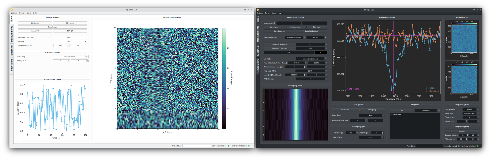

# Qscope


[](https://qnslab.github.io/qscope/qscope/index.html)

`Quantum Spin Control and Optics Programming Engine`

A framework for controlling physics experiments with a focus on quantum sensing and spin defect measurements.




## Overview

Qscope features a server-client architecture designed for flexible control of experiments:
- **Server**: Manages hardware devices and runs experiment logic
- **Client**: Controls the system through scripts or GUI
- **Measurement**: Handles experiment logic with parameter sweeps

Multiple clients (script or gui) can connect simultaneously to control the system, run measurements, and monitor data in real-time.

## Key Features

- **Distributed Architecture**: Server-client model allows multiple control points
- **Hardware Abstraction**: Unified interface for diverse scientific instruments
- **Measurement Framework**: Standardized approach to common swept measurements (T1, ODMR, PL spectra, ...)
- **Real-time Data Visualization**: Live data monitoring and analysis
- **Scripting & GUI Interfaces**: Flexible control options for different needs

## Current Systems

- **Widefield defect microscope (QDM)**: ESR, T1, Rabi measurements, etc.
- Ensemble NV measurements
- Photodiode-based systems
- Any pulsed camera measurement

## Planned Systems

- Rastered microscopy systems (confocal, AFM)

## Documentation

QScope documentation is organized according to the Diátaxis framework:

- **[Tutorials](https://qnslab.github.io/qscope/qscope/docs/tutorials.html)**: Step-by-step guides for beginners
- **[How-to Guides](https://qnslab.github.io/qscope/qscope/docs/howto.html)**: Task-oriented guides for specific use cases
- **[Explanations](https://qnslab.github.io/qscope/qscope/docs/explanation.html)**: Conceptual documentation about the system
- **[Reference](https://qnslab.github.io/qscope/qscope/index.html#header-submodules)**: Generated API documentation.

## Quick Start

### Installation

See [INSTALL.md](./INSTALL.md) for detailed installation instructions.
In brief: clone the repo and run `pip install -e .` in a Python 3.11 environment.

### Starting the GUI

```bash
# Basic start
qscope gui

# Start with mock system
qscope gui -n mock
```

## Resources

- [Developer Documentation](./DEVDOCS.md): Architecture, workflow, and hardware support
- [Installation Guide](./INSTALL.md): Detailed setup instructions
